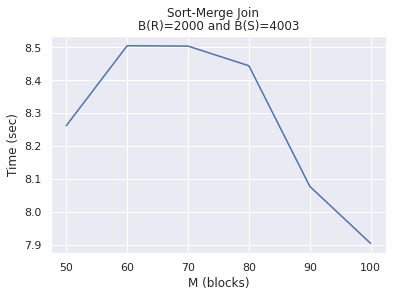
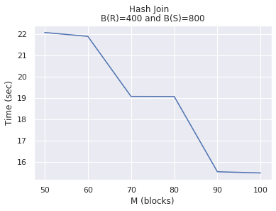

# Database Joins    
A simple python implementation of Sort-Merge Join and Hash Join for two large relations R(X, Y) and S(Y, X) with M memory blocks. These joins are used for Natural or EquiJoin implementation and would work as a two-pass implementation when memory blocks are insufficient.

### Sort Merge Join
A common join technique used when there is high chance of data being already sorted with respect to the join key. This is an efficient version of sort join wherein sorted sublists for both the relations are created. Then the first tuples from these sorted sublists are compared to get the minimum tuples from both the relation. These tuples are compared joined according to the rule.
- **open()** - Create sorted sublists for R and S, each of size M blocks.
- **getnext()** - Use 1 block for each sublist and get minimum of R & S. Join this minimum Y value with the other table and return. Check for B ( R ) + B ( S ) < M<sup>2</sup>
- **close()** - close all files

### Hash Join
Most commonly used for arbitrary for of data. Here sublists are created for both the relations based on hash value of the join key. Thus sublists for both the relation having the same hash value can be joined used nested join, as we can say that they contain the same join keys.

- **open()** - Create M hashed sublists for R and S
- **getnext()** - For each Ri and Si thus created, load the smaller of the two in the main memory and create a search structure over it. You can use M blocks to achieve this. Then recursively load the other file in the remaining blocks and for each record of this file, search corresponding records (with same join attribute value) from the other file. Check for min(B ( R ), B ( S )) < M<sup>2</sup>
- **close()** - close all files

### Execution Instructions
To execute run the following commands when inside this folder:
```sh
$ python3 main.py <path of R file> <path of S file> <sort/hash> <M>
```

The output file generated will reside in the same folder with the name `<R filename>_<S filename>_join.txt`
To validate the result `Join-Validator` can be used.

### Analysis

Varying M, the time for execution was noted for both the joins. The resulting table and graph analysis are as follows:

**System Configuration**
Processor : Intel® CoreTM i5-8250U CPU @ 1.60GHz × 8
Graphics : GeForce 940MX/PCIe/SSE2
Memory : 7.7 GiB
Disk : 202.4 GB
System : ​ Ubuntu 18.04.5 LTS 64-bit

**Sort-Merge Join:**
B ( R ) = 2000 and B ( S ) = 4003
| M Blocks | Time (sec) |
| ------ | ------ |
| 50 | 8.262556552886963 |
| 60 | 8.505091667175293 |
| 70 | 8.504024982452393 |
| 80 | 8.444282531738281 |
| 90 | 8.078277587890625 |
| 100 | 7.905089855194092 |



**Hash Join:**
B ( R ) = 400 and B ( S ) = 800
| M Blocks | Time (sec) |
| ------ | ------ |
| 50 | 22.05845832824707 |
| 60 | 21.878363132476807 |
| 70 | 19.06693196296692 |
| 80 | 19.062708377838135 |
| 90 | 15.539154767990112 |
| 100 | 15.483424425125122 |


